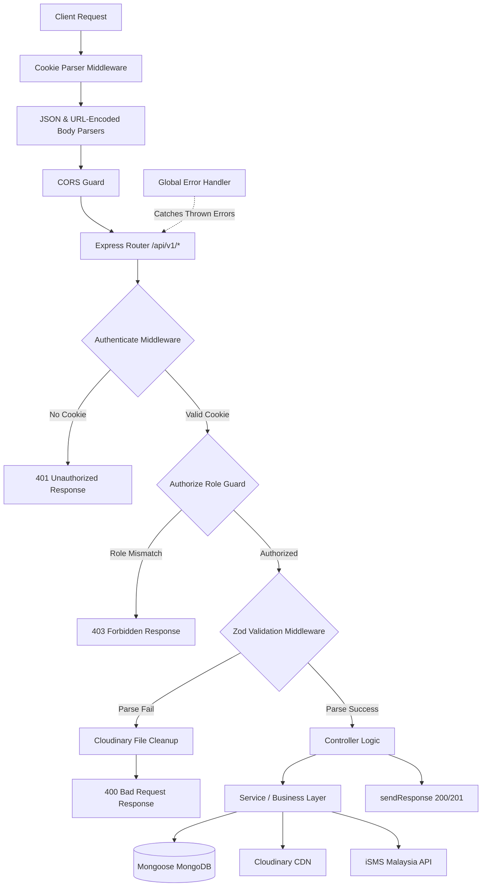
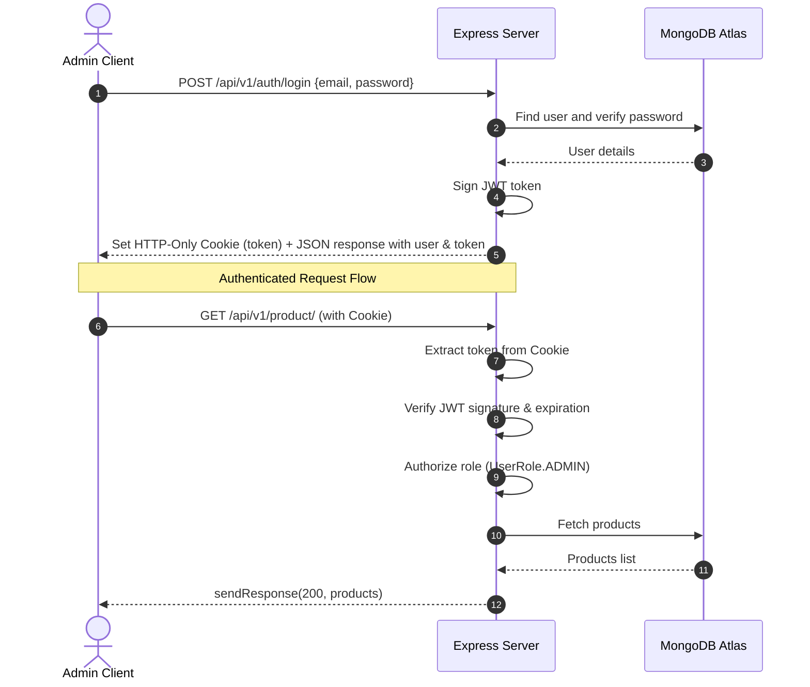

# Abroz Machinery Server

[](https://nodejs.org/)
[](https://www.typescriptlang.org/)
[](https://expressjs.com/)
[](https://mongoosejs.com/)
[](https://www.isms.com.my/)
[](https://www.docker.com/)
[](https://opensource.org/licenses/ISC)

A production-ready, highly modular RESTful API server for the **Abroz Machinery** platform—a machinery catalogue, customer directory, and communications hub. Built with **Express 5**, **TypeScript**, and **MongoDB**, featuring JWT authentication, Cloudinary storage, OTP-based password recovery, personalized iSMS bulk broadcasts, and a complete stats dashboard engine.

---

## Table of Contents

- [Abroz Machinery Server](#abroz-machinery-server)
  - [Features](#features)
  - [Tech Stack](#tech-stack)
  - [System Architecture](#system-architecture)
    - [Request Pipeline](#request-pipeline)
    - [Authentication \& Authorization Flow](#authentication--authorization-flow)
  - [Project Structure](#project-structure)
  - [Environment Variables](#environment-variables)
  - [Routing System \& API Reference](#routing-system--api-reference)
    - [Global Request/Response Configurations](#global-requestresponse-configurations)
    - [System Warmup Endpoint](#system-warmup-endpoint)
    - [Auth Endpoints — `/api/v1/auth`](#auth-endpoints---apiv1auth)
    - [User Endpoints — `/api/v1/user`](#user-endpoints---apiv1user)
    - [Admin Profile Endpoints — `/api/v1/admin`](#admin-profile-endpoints---apiv1admin)
    - [Category Endpoints — `/api/v1/category`](#category-endpoints---apiv1category)
    - [Product Endpoints — `/api/v1/product`](#product-endpoints---apiv1product)
    - [Customer Endpoints — `/api/v1/customer`](#customer-endpoints---apiv1customer)
    - [SMS Broadcast Endpoints — `/api/v1/broadcast`](#sms-broadcast-endpoints---apiv1broadcast)
    - [Dashboard Stats Endpoints — `/api/v1/stats`](#dashboard-stats-endpoints---apiv1stats)
  - [Getting Started — Local Development](#getting-started---local-development)
  - [Running with Docker](#running-with-docker)
  - [CORS Whitelist](#cors-whitelist)
  - [License](#license)

---

## Features

- **JWT Authentication via HTTP-Only Cookies**: Secure session management. The server issues JWT access tokens stored exclusively in client-side cookies with `httpOnly`, `secure`, and `sameSite: none` properties to eliminate XSS token leakage.
- **OTP Password Recovery**: Automated 6-digit verification code generation delivered via EJS-templated HTML email (Nodemailer/SMTP), enabling secure password resets.
- **Role-Based Access Control**: Route guarding mechanism backing up administrative actions with a strict `UserRole.ADMIN` check.
- **Dynamic Query Engine (QueryBuilder)**: Powerful pagination (`page`/`limit`), text search across multiple fields, sorting, field projection, and numerical range filtering (e.g. `minQuantity`/`maxQuantity` translating to `$gte`/`$lte`).
- **Product Catalogue Management**: Complete CRUD operations, supporting multi-image uploads (up to 5 images) directly streamed to Cloudinary, with automatic asset purging from Cloudinary upon product modification or deletion.
- **Customer Directory**: Secure contact hub managing names and mobile numbers.
- **Personalized Bulk SMS (iSMS)**: Integrate directly with iSMS Malaysia JSON API to dispatch bulk messages (supporting chunks of 50, automatic ASCII/Unicode detection). Incorporates template variable substitution to personalize message bodies (replacing `[name]` placeholders with customer names).
- **Dashboard Analytics & Activity Logging**: Day-over-day growth percentages, 30-day product click trends, top viewed products, and administrative activity logs.
- **Admin Auto-Seeding**: Idempotent administrative user generation on application initialization, using environment properties.
- **Nginx Reverse Proxy & Load Balancing**: Pre-configured Docker Compose setup firing up 5 scaled replicas behind an Nginx reverse proxy.

---

## Tech Stack

| Layer | Technology | Description |
|---|---|---|
| **Runtime Environment** | Node.js 22 (Alpine-based in Docker) | Performance & security-focused JS runtime |
| **Development Language**| TypeScript 5.x | Typings and structure |
| **Web Framework** | Express 5.x | Minimalist RESTful framework |
| **Database ODM** | Mongoose 9.x (MongoDB Atlas) | Database modeling |
| **Image Hosting** | Cloudinary | Asset delivery CDN |
| **Storage Middleware**  | Multer (`multer-storage-cloudinary`)| Multipart/form-data processing |
| **Validation Layer**    | Zod 4.x | Safe schema validation & type inference |
| **Email Service**       | Nodemailer + EJS templates | OTP transmission |
| **SMS Gateway**         | iSMS Malaysia JSON API | SMS dispatch |
| **Containerisation**   | Docker + Docker Compose + Nginx | Local clustering and load balancing |
| **Package Manager**     | pnpm | Disk space and dependency efficiency |

---

## System Architecture

### Request Pipeline

All HTTP requests sent to the server flow through the following middleware stack:



### Authentication & Authorization Flow

Authentication is stateless and managed via signed JWT tokens passed through client cookies.



---

## Project Structure

The project implements a modular structure where each business entity is isolated in its own folder under `src/app/modules/`.

```
src/
├── app.ts                        # Express app and middleware setup
├── server.ts                     # Main entry point (DB connection & listen)
└── app/
    ├── builder/
    │   └── queryBuilder.ts       # Utility for mongoose querying (search, filter, pagination, etc.)
    ├── config/
    │   ├── env.ts                # Validates & exports environment configuration
    │   ├── cloudinary.ts         # Cloudinary configuration & file deletion helper
    │   └── multer.ts             # Multer setup integrated with Cloudinary storage
    ├── helper/
    │   ├── AppError.ts           # Extended Error class supporting HTTP status codes
    │   ├── activity.helper.ts    # Centralized admin activity logger helper
    │   └── handleZodError.ts     # Maps Zod validation issues into uniform error arrays
    ├── interface/
    │   └── error.interface.ts    # TypeScript definitions for error response payloads
    ├── middlewares/
    │   ├── globalErrorHandler.ts # Catches all uncaught/explicitly thrown errors
    │   ├── notFound.ts           # Catch-all router handler (404)
    │   ├── zodValidation.ts      # Standard schema validation middleware
    │   └── zodValidationWithCleanup.ts # Validation helper executing Cloudinary deletions on schema failures
    ├── models/
    │   ├── admin.model.ts        # Admin profile schema (contains direct contact analytics)
    │   ├── user.model.ts         # Core User credential schema (handles password hashing)
    │   ├── product.model.ts      # Product schema including click histories
    │   ├── category.model.ts     # Category schema
    │   ├── customer.model.ts     # Customer directory schema
    │   ├── broadcastHistory.model.ts # Bulk SMS dispatch logs schema
    │   ├── activity.model.ts     # Admin action history log schema
    │   └── stats.model.ts        # Analytics subdocuments
    ├── modules/
    │   ├── auth/                 # Login, password recovery, profile retrieval, password modification
    │   ├── admin/                # Public/private settings, social links, contact click updates
    │   ├── user/                 # Profile modifications (avatar, name)
    │   ├── category/             # Category CRUD operations
    │   ├── product/              # Product CRUD, multi-image streaming, and view tracking
    │   ├── customer/             # Customer registry CRUD operations
    │   ├── broadcast/            # Personalized bulk SMS dispatch via iSMS Malaysia
    │   └── stats/                # Dashboard analytics aggregation
    ├── routes/
    │   └── index.ts              # Route registry (prefixes sub-modules onto /api/v1)
    ├── seeds/
    │   └── admin.seed.ts         # Automatically populates default Admin credentials
    ├── shared/
    │   ├── catchAsync.ts         # Wrapper to delegate promise rejections to globalErrorHandler
    │   └── sendResponse.ts       # Utility ensuring consistent outgoing JSON shape
    ├── templates/
    │   └── otp.ejs               # EJS template used for OTP emails
    ├── types/                    # Shared typings (User, Product, Query, Admin, etc.)
    └── utils/
        ├── cookie.ts             # Express cookie manipulations
        ├── email.ts              # Nodemailer utility config
        ├── generateOtp.ts        # 6-digit OTP code & expiration generator
        ├── jwt.ts                # Token signing & verification wrappers
        ├── token.ts              # Express-specific cookie setting helpers
        └── sms.ts                # iSMS Malaysia API integration (personalization & batching)
```

---

## Environment Variables

Copy `.env.example` to `.env` and fill in all properties. All values are validated during application startup, and execution will halt if any variables are missing.

```env
# Server Configuration
PORT=5000                         # Port to launch the Express server

# Database Configuration
MONGO_URI=mongodb+srv://<user>:<pass>@cluster.mongodb.net/abroz

# JWT Configuration
JWT_SECRET=your_super_secret_jwt_key
JWT_EXPIRES_IN=7d                  # Duration of token validity (e.g. 7d, 24h, 1h)

# Default Administrator Seeding (Generated on first run)
ADMIN_NAME=Admin
ADMIN_EMAIL=admin@example.com
ADMIN_PASSWORD=secure_seed_password

# Cloudinary Integration
CLOUDINARY_CLOUDE_NAME=your_cloud_name
CLOUDINARY_API_KEY=your_cloudinary_api_key
CLOUDINARY_API_SECRET=your_cloudinary_api_secret

# SMTP Email Settings (OTP dispatch)
SMTP_HOST=smtp.gmail.com
SMTP_PORT=587
SMTP_USER=your_email@gmail.com
SMTP_PASS=your_gmail_app_password
SMTP_FROM=no-reply@abrozmachinery.com

# iSMS Malaysia Gateway Credentials (https://www.isms.com.my/)
ISMS_USERNAME=your_isms_username
ISMS_SECRET_KEY=your_isms_api_secret_key
ISMS_BASE_URL=https://www.isms.com.my
```

---

## Routing System & API Reference

All application endpoints are prefixed with `/api/v1`.

### Global Request/Response Configurations

#### Success Response Structure
All successful endpoints return a JSON payload with a `200` or `201` status code:
```json
{
  "success": true,
  "message": "Information indicating response status",
  "data": {},        // Array or Object response data
  "meta": {          // Provided exclusively on paginated requests
    "total": 120,
    "page": 1,
    "limit": 10,
    "totalPages": 12
  }
}
```

#### Error Response Structure
Unsuccessful requests or schema validation failures return a standard error shape:
```json
{
  "success": false,
  "message": "Error details summary",
  "errorSources": [
    {
      "path": "body.field_name",
      "message": "Specific validation failure instruction"
    }
  ]
}
```

#### Authentication Rules
Endpoints requiring authentication are marked with 🔒. 
- Authentication is strictly checked through a JWT token stored in the `token` cookie.
- If the token is verified successfully, its payload (`userId`, `role`, `email`) is bound onto the Express request object as `req.user`.
- Role verification (e.g. `UserRole.ADMIN`) is checked after the token is verified.

---

### System Warmup Endpoint

#### `GET /api/v1/warmup`
Warms up the API service and checks database connectivity.
- **Authorization**: Public
- **Request Parameters**: None
- **Response Shape**:
  ```json
  {
    "success": true,
    "message": "warm",
    "db": "connected",   // "connected" or "connecting"
    "ts": 1719864000000
  }
  ```

---

### Auth Endpoints — `/api/v1/auth`

#### `POST /login`
Authenticates user credentials, sets the `token` cookie, and returns the token.
- **Authorization**: Public
- **Request Body**:
  ```json
  {
    "email": "admin@example.com", // Valid email format (Required)
    "password": "securepassword"   // Minimum length 8 (Required)
  }
  ```
- **Response Shape**:
  ```json
  {
    "success": true,
    "message": "Login successful",
    "data": {
      "token": "JWT_STRING",
      "user": {
        "_id": "USER_ID",
        "email": "admin@example.com",
        "role": "admin",
        "createdAt": "2026-07-01T12:00:00.000Z",
        "updatedAt": "2026-07-01T12:00:00.000Z"
      }
    }
  }
  ```

#### `POST /forget-password`
Generates a 6-digit OTP code and emails it to the user. Valid for 5 minutes.
- **Authorization**: Public
- **Request Body**:
  ```json
  {
    "email": "admin@example.com"
  }
  ```
- **Response Shape**:
  ```json
  {
    "success": true,
    "message": "OTP sent to email. Valid for 5 minutes."
  }
  ```

#### `POST /verify-email`
Verifies the OTP code emailed to the user. Must be executed successfully before password resetting is permitted.
- **Authorization**: Public
- **Request Body**:
  ```json
  {
    "email": "admin@example.com",
    "otp": "123456" // Exactly 6 digits (Required)
  }
  ```
- **Response Shape**:
  ```json
  {
    "success": true,
    "message": "Email verified. You can now reset your password."
  }
  ```

#### `POST /reset-password`
Overwrites the user's password. Requires verification via the `/verify-email` endpoint first.
- **Authorization**: Public
- **Request Body**:
  ```json
  {
    "email": "admin@example.com",
    "newPassword": "newsecurepassword123" // Minimum length 8 (Required)
  }
  ```
- **Response Shape**:
  ```json
  {
    "success": true,
    "message": "Password reset successful."
  }
  ```

#### `GET /me`
Retrieves profile information for the authenticated user.
- **Authorization**: 🔒 Admin
- **Response Shape**:
  ```json
  {
    "success": true,
    "message": "User fetched successfully",
    "data": {
      "_id": "USER_ID",
      "email": "admin@example.com",
      "role": "admin",
      "name": "Admin User",
      "avatar": "https://res.cloudinary.com/..."
    }
  }
  ```

#### `PATCH /change-password`
Changes the password for the currently logged in administrator.
- **Authorization**: 🔒 Admin
- **Request Body**:
  ```json
  {
    "currentPassword": "oldsecurepassword", // Required
    "newPassword": "newsecurepassword"      // Required
  }
  ```
- **Response Shape**:
  ```json
  {
    "success": true,
    "message": "Password changed successfully"
  }
  ```

---

### User Endpoints — `/api/v1/user`

#### `PATCH /profile`
Updates profile metadata for the authenticated user. Accepts files.
- **Authorization**: 🔒 Any authenticated user
- **Content-Type**: `multipart/form-data`
- **Form Fields**:
  - `name`: string (Optional)
  - `image`: file (Optional, single avatar file)
- **Response Shape**:
  ```json
  {
    "success": true,
    "message": "User profile updated successfully",
    "data": {
      "_id": "USER_ID",
      "email": "user@example.com",
      "role": "user",
      "name": "Updated Name",
      "avatar": "https://res.cloudinary.com/..."
    }
  }
  ```

---

### Admin Profile Endpoints — `/api/v1/admin`

#### `GET /info`
Retrieves public profile details, social handles, and contact click analytics for the administrator.
- **Authorization**: Public
- **Response Shape**:
  ```json
  {
    "success": true,
    "message": "Admin profile info retrieved",
    "data": {
      "_id": "ADMIN_ID",
      "businessName": "Abroz Machinery",
      "businessDescription": "...",
      "businessAddress": "...",
      "shippingInfo": "...",
      "social": {
        "facebookPage1": "https://facebook.com/...",
        "facebookPage2": "",
        "messengerId": "abroz.machinery",
        "whatsappNumber": "60123456789",
        "emailAddress": "contact@abroz.com",
        "websiteLink": "https://abroz.com"
      },
      "clicks": {
        "whatsapp": 124,
        "messenger": 45
      }
    }
  }
  ```

#### `PATCH /profile`
Updates public business settings and social URLs.
- **Authorization**: 🔒 Admin
- **Request Body** (At least one property must be provided):
  ```json
  {
    "businessName": "New Brand Name",       // Optional
    "businessDescription": "Updated Bio",   // Optional
    "businessAddress": "HQ Street Address",  // Optional
    "shippingInfo": "Delivery details",     // Optional
    "social": {                             // Optional
      "facebookPage1": "https://facebook.com/page1", // URL format or empty string
      "facebookPage2": "https://facebook.com/page2", // URL format or empty string
      "messengerId": "messenger_id",
      "whatsappNumber": "60123456789",
      "emailAddress": "info@brand.com",              // Email format
      "websiteLink": "https://brand.com"             // URL format or empty string
    }
  }
  ```
- **Response Shape**: Returns the updated admin object inside the `data` key.

#### `PATCH /clicks`
Increments the click count for a social contact link (WhatsApp or Messenger). Triggered by the client application.
- **Authorization**: Public
- **Request Body**:
  ```json
  {
    "type": "whatsapp" // Either "whatsapp" or "messenger" (Required)
  }
  ```
- **Response Shape**: Returns the updated admin object inside the `data` key.

---

### Category Endpoints — `/api/v1/category`

#### `POST /`
Creates a new product category.
- **Authorization**: 🔒 Admin
- **Request Body**:
  ```json
  {
    "name": "Excavators",       // String, minimum length 1 (Required)
    "description": "Heavy machinery category" // String (Optional)
  }
  ```
- **Response Shape**: Returns the created category object.

#### `GET /`
Retrieves all categories.
- **Authorization**: Public
- **Response Shape**: Returns an array of category documents.

#### `GET /:id`
Retrieves a single category.
- **Authorization**: Public
- **Response Shape**: Returns the category matching the path parameter.

#### `PATCH /:id`
Modifies category settings.
- **Authorization**: 🔒 Admin
- **Request Body** (At least one property must be provided):
  ```json
  {
    "name": "Heavy Excavators",
    "description": "Updated category description"
  }
  ```
- **Response Shape**: Returns the updated category object.

#### `DELETE /:id`
Deletes a category.
- **Authorization**: 🔒 Admin
- **Response Shape**:
  ```json
  {
    "success": true,
    "message": "Category deleted successfully"
  }
  ```

---

### Product Endpoints — `/api/v1/product`

#### `POST /`
Creates a new product catalog listing. Accepts file uploads.
- **Authorization**: 🔒 Admin
- **Content-Type**: `multipart/form-data`
- **Form Fields**:
  - `name`: string (Required)
  - `description`: string (Required)
  - `categoryId`: MongoDB ObjectId (Required)
  - `quantity`: integer >= 0 (Required)
  - `condition`: string (`"new"`, `"used"`, or `"refurbished"`) (Required)
  - `origin`: string (Optional)
  - `partNumber`: string (Optional)
  - `brandName`: string (Optional)
  - `compatibility`: string (Optional)
  - `shippingInfo`: string (Optional)
  - `conditionNotes`: string (Optional)
  - `status`: string (`"active"` or `"draft"`) (Optional, defaults to `"draft"`)
  - `features`: string[] or string array (Optional)
  - `images`: file[] (Optional, up to 5 image files)
- **Response Shape**: Returns the created product object.

#### `GET /`
Lists products using the flexible QueryBuilder system.
- **Authorization**: Public
- **Query Parameters**:
  - `search`: Searches across `name`, `origin`, `brandName`, and `partNumber` fields (Case-insensitive regex)
  - `categoryId`: Filters by exact Category ID
  - `condition`: Filters by condition (`"new"`, `"used"`, `"refurbished"`)
  - `status`: Filters by catalog status (`"active"`, `"draft"`)
  - `sort`: Database key to sort results by (Defaults to `"createdAt"`)
  - `order`: Sort direction (`"asc"` or `"desc"`, Defaults to `"desc"`)
  - `page`: Page index (Defaults to `1`)
  - `limit`: Page count (Defaults to `10`, maximum limits are clamped to `100`)
  - `fields`: Comma-separated list of properties to include in the output (e.g. `name,images,brandName`)
  - **Range Filters (`min[Field]` / `max[Field]`)**:
    - Querying `minQuantity=10` translates to a `$gte: 10` filter on the `quantity` field.
    - Querying `maxQuantity=50` translates to a `$lte: 50` filter on the `quantity` field.
- **Response Shape**: Returns a list of products under `data` and pagination details under `meta`.

#### `GET /:id`
Retrieves details for a single product. **Side Effect**: Increments the product's view click metrics for today.
- **Authorization**: Public
- **Response Shape**: Returns the matching product document with populated category data.

#### `PATCH /:id`
Updates product specifications. If new files are uploaded under the `images` field, all old images are automatically removed from Cloudinary storage.
- **Authorization**: 🔒 Admin
- **Content-Type**: `multipart/form-data`
- **Form Fields**: Same fields as `POST /` (All fields optional)
- **Response Shape**: Returns the updated product object.

#### `DELETE /:id`
Permanently deletes a product listing and removes all its images from Cloudinary storage.
- **Authorization**: 🔒 Admin
- **Response Shape**:
  ```json
  {
    "success": true,
    "message": "Product deleted successfully"
  }
  ```

---

### Customer Endpoints — `/api/v1/customer`

#### `POST /`
Creates a customer record in the directory.
- **Authorization**: 🔒 Admin
- **Request Body**:
  ```json
  {
    "name": "John Doe",           // String, length 2-100 (Required)
    "mobileNumber": "+60123456789" // String, must be unique (Required)
  }
  ```
- **Response Shape**: Returns the created customer object.

#### `GET /`
Retrieves a paginated list of customers.
- **Authorization**: 🔒 Admin
- **Query Parameters**:
  - `search`: Searches across `name` and `mobileNumber` fields
  - `sort`, `order`, `page`, `limit`, `fields` (Supported by QueryBuilder)
- **Response Shape**: Returns an array of customers and pagination details.

#### `GET /:id`
Retrieves details for a single customer.
- **Authorization**: 🔒 Admin
- **Response Shape**: Returns the customer object.

#### `PATCH /:id`
Updates customer details.
- **Authorization**: 🔒 Admin
- **Request Body** (At least one property must be provided):
  ```json
  {
    "name": "John Updated",
    "mobileNumber": "+60987654321" // Must be unique if modified
  }
  ```
- **Response Shape**: Returns the updated customer object.

#### `DELETE /:id`
Deletes a customer from the database.
- **Authorization**: 🔒 Admin
- **Response Shape**:
  ```json
  {
    "success": true,
    "message": "Customer deleted successfully"
  }
  ```

---

### SMS Broadcast Endpoints — `/api/v1/broadcast`

#### `POST /`
Dispatches personalized bulk SMS messages using iSMS Malaysia.
- **Authorization**: 🔒 Admin
- **Workflow**:
  1. Resolves customer details for the provided `customerIds`.
  2. Replaces `[name]` placeholder values in the `message` template (case-insensitive) with each customer's actual name.
  3. Splits recipient lists into chunks of 50 (iSMS API limit).
  4. Automatically detects Unicode characters and adjusts encoding (Type 1 for ASCII, Type 2 for Unicode).
  5. Records the dispatch log in `BulkSmsBatch` history with a state of `"completed"` or `"failed"`.
- **Request Body**:
  ```json
  {
    "customerIds": ["609f7a77e8a93c001f3796d1", "609f7a77e8a93c001f3796d2"], // Array of 24-char ObjectIds (Required, min 1)
    "message": "Hello [name]! A new bulldozer has arrived at our warehouse.", // String, length 1-1000 (Required)
    "batchName": "Promo July 2026" // Custom log label (Optional)
  }
  ```
- **Response Shape**:
  ```json
  {
    "success": true,
    "message": "Bulk SMS broadcast initiated and logged successfully",
    "data": {
      "_id": "BATCH_HISTORY_ID",
      "batchName": "Promo July 2026",
      "message": "Hello [name]! A new bulldozer has arrived at our warehouse.",
      "totalRecipients": 2,
      "successCount": 2,
      "failedCount": 0,
      "status": "completed", // "pending", "processing", "completed", "failed"
      "provider": "isms",
      "apiResponse": {
        "code": 2000,
        "status": "success",
        "msgid": "..."
      },
      "startedAt": "2026-07-01T20:00:00.000Z",
      "completedAt": "2026-07-01T20:00:01.000Z",
      "createdAt": "2026-07-01T20:00:00.000Z",
      "updatedAt": "2026-07-01T20:00:01.000Z"
    }
  }
  ```

---

### Dashboard Stats Endpoints — `/api/v1/stats`

#### `GET /dashboard`
Aggregates and returns dashboard statistics, growth metrics, and activity logs.
- **Authorization**: 🔒 Admin
- **Response Shape**:
  ```json
  {
    "success": true,
    "message": "Dashboard stats fetched successfully",
    "data": {
      "products": {
        "total": 145,
        "todayCount": 5,
        "growthPercent": 25
      },
      "categories": {
        "total": 12,
        "todayCount": 0,
        "growthPercent": 0
      },
      "whatsappClicks": {
        "total": 450,
        "todayCount": 15,
        "growthPercent": 50
      },
      "messengerClicks": {
        "total": 120,
        "todayCount": 2,
        "growthPercent": -33
      },
      "productClicksLast30Days": [
        { "date": "2026-06-15", "count": 22 },
        { "date": "2026-06-16", "count": 45 }
      ],
      "activitiesLast7Days": [
        {
          "id": "60af6c88f2b34a1122a33445",
          "method": "CREATE",
          "description": "Created product: Caterpillar D11",
          "createdAt": "2026-07-01T15:20:00.000Z"
        }
      ],
      "topViewedProducts": [
        {
          "id": "60df8b22a2b34c2233b44556",
          "name": "Caterpillar D11",
          "category": "Bulldozers",
          "images": ["https://res.cloudinary.com/..."],
          "totalClicks": 984,
          "growthPercent": 14
        }
      ]
    }
  }
  ```

---

## Getting Started — Local Development

### Prerequisites
- **Node.js** v22+
- **pnpm** (preferred) or npm
- **MongoDB** instance (Local or Atlas cloud cluster)
- **Cloudinary** developer account
- **SMTP Credentials** (e.g. Gmail App Password)
- **iSMS Malaysia** developer credentials

### 1. Clone the Repository
```bash
git clone https://github.com/meshal10613/Abroz-Machinery-Server--.git
cd Abroz-Machinery-Server--
```

### 2. Install Dependencies
```bash
pnpm install
```

### 3. Configure the Environment
```bash
cp .env.example .env
# Open .env and fill in your connection strings and api keys
```

### 4. Launch the Development Server
```bash
pnpm dev
```
The server runs locally with hot reloading at `http://localhost:5000`. On first boot, the seeder automatically populates the admin account.

### 5. Compile and Start in Production Mode
```bash
pnpm build  # Compiles TypeScript source to dist/server.js using tsup
pnpm start  # Runs the compiled JavaScript build
```

---

## Running with Docker

The containerization stack spins up **5 application replicas** and routes incoming traffic through an **Nginx reverse proxy** acting as a load balancer on port `80`.

### 1. Configure the Environment
Ensure your `.env` contains correct credentials. Use hostname `redis` inside Docker if caching services are ever re-enabled.

### 2. Build and Launch Containers
```bash
docker compose up --build -d
```
This command runs the following steps in detached mode:
1. Builds the Node.js application image using the `Dockerfile`.
2. Starts 5 parallel application container instances (each bound internally to port `5000`).
3. Starts Nginx on port `80`, configured with round-robin load balancing across all 5 instances.

### 3. Verification
```bash
curl http://localhost/api/v1/warmup
```

### 4. Useful Docker Commands
```bash
# View aggregated service logs
docker compose logs -f

# View logs exclusively for application instances
docker compose logs -f app

# Scale application instances up or down
docker compose up -d --scale app=8

# Halt execution and teardown containers
docker compose down

# Teardown containers and wipe associated anonymous volumes
docker compose down -v
```

---

## CORS Whitelist

The API accepts credentialed request traffic (`credentials: true`) from the following origins:
- `http://localhost:3000` (Local Frontend Dev)
- `https://abroz-admin-dashboard.vercel.app` (Production Admin Panel)
- `https://abroz-admin-dashboard-with-api.vercel.app` (Staging Admin Panel)

Additional origins can be configured in `src/app.ts`.

---

## License

This software is licensed under the [ISC License](https://opensource.org/licenses/ISC).

Copyright © 2026 [Abroz Machinery](https://github.com/meshal10613/Abroz-Machinery-Server--). All rights reserved.
